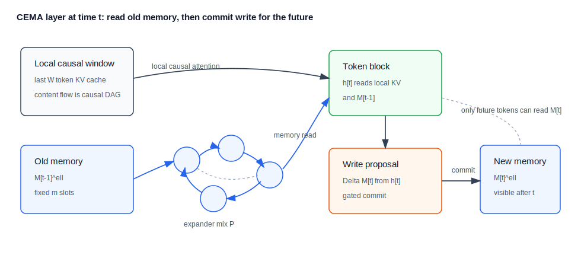
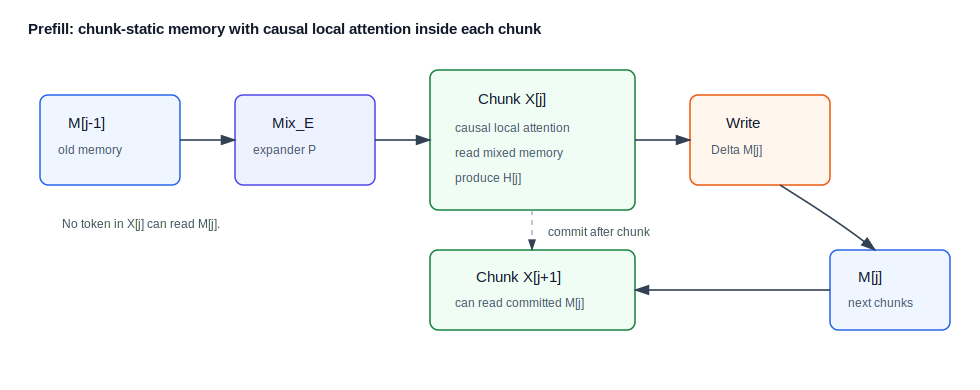

# Causal Expander Memory Attention 架构备忘录

日期：2026-06-14

本文整理一个候选方向：**Causal Expander Memory Attention**，简称 **CEMA**。核心思想是把 causal token 图和 expander 图分开：

- token 内容流仍然严格 causal，展开后是 DAG；
- 固定大小的 memory slots 内部使用强连通 directed expander；
- prefill 以 chunk 为单位并行读 memory，chunk 结束后提交写入；
- decode 以固定大小状态递推，不随上下文长度线性增长 KV cache。

这个结构不试图证明 causal attention mask 本身是普通 directed expander。它把 expander 理论放到固定大小的 memory state graph 上，目标指标从 token 图的 stationary mixing 改成 memory-slot mixing、写入负载均衡、长程信息保留和 decode 状态有界。

## 1. 问题定位

标准 next-token prediction 要求位置 \(t\) 的预测不能依赖未来 token 内容：

\[
h_t \;\text{may depend on}\; x_{\le t}, \qquad h_t \;\text{must not depend on}\; x_{>t}.
\]

因此，如果节点表示“携带 token 内容的位置”，边表示可用的信息流，那么 causal mask 的展开图必然是 DAG 或近似 DAG，不可能强连通，也不可能拥有普通 directed expander 的 stationary mixing 解释。

CEMA 的转向是：

\[
\text{causal token DAG} \quad + \quad \text{strongly connected memory expander}.
\]

token 图只负责因果正确性；memory 图负责固定状态中的快速混合和负载均衡。

## 2. 基本对象

设模型有 \(L\) 层，每层维护 \(m\) 个 memory slots：

\[
M_t^\ell =
\begin{bmatrix}
m_{t,1}^\ell\\
\cdots\\
m_{t,m}^\ell
\end{bmatrix}
\in \mathbb{R}^{m \times d_m},
\qquad
\ell = 1,\ldots,L.
\]

memory slots 上给定一张 \(D\)-in/\(D\)-out regular directed expander，row-normalized transition matrix 为

\[
P \in \mathbb{R}^{m \times m}.
\]

理想情况下要求

\[
P\mathbf{1}=\mathbf{1}, \qquad
\mathbf{1}^{\top}P=\mathbf{1}^{\top}, \qquad
\left\lVert P-J_m \right\rVert_2 \le \rho < 1,
\]

其中

\[
J_m=\frac{1}{m}\mathbf{1}\mathbf{1}^{\top}.
\]

这给出 memory slots 的快速混合：

\[
\left\lVert P^k-J_m \right\rVert_2 \le \rho^k.
\]

实际实现可以用 lazy expander mix：

\[
P_\eta=(1-\eta)I+\eta P,
\]

则在 \(1^\perp\) 上有

\[
\left\lVert P_\eta-J_m \right\rVert_2
\le
(1-\eta)+\eta\rho.
\]

## 3. 单步层内计算

对某一层 \(\ell\)，令当前 token hidden 为 \(h_t^{\ell-1}\)。CEMA 遵守 **read-before-write**：

\[
h_t^\ell \;\text{can read}\; M_{t-1}^\ell,
\qquad
h_t^\ell \;\text{writes}\; M_t^\ell \;\text{only for future positions}.
\]

### 3.1 Memory expander mix

先对旧 memory 做 slot mixing：

\[
\widetilde{M}_{t-1}^\ell
=
\operatorname{LN}
\left(
(1-\alpha_E)M_{t-1}^\ell
+\alpha_E P M_{t-1}^\ell W_E^\ell
\right).
\]

如果 \(P\) 是稀疏 \(D\)-regular expander，这一步复杂度是

\[
O(mD d_m).
\]

### 3.2 Read: token reads memory

memory read 是普通 cross-attention，只是 key/value 来自固定大小 memory：

\[
q_t^R = h_t^{\ell-1}W_Q^{R,\ell},
\]

\[
K_M^\ell = \widetilde{M}_{t-1}^\ell W_K^{R,\ell},
\qquad
V_M^\ell = \widetilde{M}_{t-1}^\ell W_V^{R,\ell}.
\]

\[
r_t^\ell
=
\operatorname{softmax}
\left(
\frac{q_t^R (K_M^\ell)^\top}{\sqrt{d_r}}
\right)
V_M^\ell.
\]

同时保留一个短程 causal attention 分支，例如 window \(W\)：

\[
c_t^\ell
=
\operatorname{Attn}_{\text{causal-local}}
\left(
h_t^{\ell-1},
h_{\max(1,t-W):t}^{\ell-1}
\right).
\]

二者融合：

\[
u_t^\ell
=
W_C^\ell c_t^\ell + W_R^\ell r_t^\ell,
\]

\[
h_t^\ell
=
\operatorname{FFN}^\ell
\left(
\operatorname{LN}(h_t^{\ell-1}+u_t^\ell)
\right)
+ h_t^{\ell-1}+u_t^\ell.
\]

### 3.3 Write: token writes memory

写入可以让 memory slots 主动从 token hidden 中取信息。单 token decode 时，令

\[
Q_W^\ell=\widetilde{M}_{t-1}^\ell W_Q^{W,\ell},
\qquad
k_t^W=h_t^\ell W_K^{W,\ell},
\qquad
v_t^W=h_t^\ell W_V^{W,\ell}.
\]

slot-wise write weights：

\[
a_t^\ell
=
\operatorname{softmax}_{\text{slots}}
\left(
\frac{Q_W^\ell (k_t^W)^\top}{\sqrt{d_w}}
\right)
\in \mathbb{R}^{m \times 1}.
\]

写入增量：

\[
\Delta M_t^\ell
=
a_t^\ell (v_t^W)^\top
\in \mathbb{R}^{m \times d_m}.
\]

门控提交：

\[
G_t^\ell
=
\sigma
\left(
\left[\widetilde{M}_{t-1}^\ell;\Delta M_t^\ell\right]W_G^\ell+b_G^\ell
\right),
\]

\[
M_t^\ell
=
\operatorname{LN}
\left(
(1-G_t^\ell)\odot \widetilde{M}_{t-1}^\ell
+G_t^\ell\odot \Delta M_t^\ell
\right).
\]

注意这里的 \(M_t^\ell\) 只能被 \(t+1,t+2,\ldots\) 读取，所以不会破坏 NTP。

## 4. 架构图

## 5. Prefill

给定 prompt 长度 \(N\)，将其切成 \(J\) 个 chunk：

\[
X_j = x_{s_j:e_j},
\qquad
|X_j| \le C,
\qquad
j=1,\ldots,J.
\]

prefill 的推荐默认是 **chunk-static memory**：

1. chunk \(j\) 的所有 token 读取同一个旧 memory \(M_{j-1}^\ell\)；
2. chunk 内仍做 causal local attention，因此 token 间局部信息不丢；
3. chunk 的 memory 写入在 chunk 结束后一次性提交成 \(M_j^\ell\)；
4. \(M_j^\ell\) 只对后续 chunk 可见。

### 5.1 Chunk read

令 \(H_j^{\ell-1}\in\mathbb{R}^{C\times d}\) 是 chunk hidden。先混合旧 memory：

\[
\widetilde{M}_{j-1}^\ell
=
\operatorname{Mix}_E(M_{j-1}^\ell).
\]

chunk 内局部 causal 分支：

\[
C_j^\ell
=
\operatorname{Attn}_{\text{causal-local}}
\left(
H_j^{\ell-1}
\right).
\]

memory read 分支：

\[
R_j^\ell
=
\operatorname{softmax}
\left(
\frac{
(H_j^{\ell-1}W_Q^{R,\ell})
(\widetilde{M}_{j-1}^\ell W_K^{R,\ell})^\top
}{
\sqrt{d_r}
}
\right)
\widetilde{M}_{j-1}^\ell W_V^{R,\ell}.
\]

融合：

\[
H_j^\ell
=
\operatorname{Block}^\ell
\left(
H_j^{\ell-1}, C_j^\ell, R_j^\ell
\right).
\]

### 5.2 Chunk write

让 memory slots 从整个 chunk 中读取要保存的信息：

\[
Q_{M,j}^\ell
=
\widetilde{M}_{j-1}^\ell W_Q^{W,\ell},
\]

\[
K_{H,j}^\ell
=
H_j^\ell W_K^{W,\ell},
\qquad
V_{H,j}^\ell
=
H_j^\ell W_V^{W,\ell}.
\]

每个 slot 在 chunk tokens 上归一化：

\[
A_j^\ell
=
\operatorname{softmax}_{\text{tokens}}
\left(
\frac{
Q_{M,j}^\ell (K_{H,j}^\ell)^\top
}{
\sqrt{d_w}
}
\right)
\in \mathbb{R}^{m\times C}.
\]

\[
\Delta M_j^\ell
=
A_j^\ell V_{H,j}^\ell.
\]

提交：

\[
G_j^\ell
=
\sigma
\left(
\left[
\widetilde{M}_{j-1}^\ell;\Delta M_j^\ell
\right]
W_G^\ell+b_G^\ell
\right),
\]

\[
M_j^\ell
=
\operatorname{LN}
\left(
(1-G_j^\ell)\odot \widetilde{M}_{j-1}^\ell
+G_j^\ell\odot \Delta M_j^\ell
\right).
\]

### 5.3 Prefill 因果性

对 chunk \(j\) 内的任意 token \(t\in [s_j,e_j]\)，其 hidden 只能读

\[
x_{\le t} \quad \text{and} \quad M_{j-1}.
\]

而

\[
M_j
\]

是在 chunk 结束后才产生，只能被 chunk \(j+1,j+2,\ldots\) 使用。因此即使 \(\Delta M_j\) 聚合了整个 chunk，仍不会让同一 chunk 内的早期 token 看到未来 token。

这个版本有一个 chunk latency：

\[
\text{memory visibility delay} = C.
\]

如果希望更接近逐 token decode，可以用 **chunk-scan memory**：把 chunk 再拆成 micro-chunks，或者把写入算子设计成 associative update，用 parallel scan 计算中间 memory states。这个方向更复杂，但与 RetNet、linear attention 的 chunkwise recurrent 形式更接近。

### 5.4 Prefill 图

## 6. Decode

decode 阶段每次只生成一个新 token。每层缓存两类状态：

\[
\text{short KV cache of length } W,
\qquad
M_{t-1}^\ell \in \mathbb{R}^{m\times d_m}.
\]

对新 token \(x_t\)，每层做：

\[
\widetilde{M}_{t-1}^\ell=\operatorname{Mix}_E(M_{t-1}^\ell),
\]

\[
c_t^\ell=
\operatorname{Attn}_{\text{local}}
\left(
h_t^{\ell-1},
\operatorname{KVCache}_{t-W:t}^{\ell-1}
\right),
\]

\[
r_t^\ell=
\operatorname{Attn}_{\text{memory}}
\left(
h_t^{\ell-1},
\widetilde{M}_{t-1}^\ell
\right),
\]

\[
h_t^\ell=\operatorname{Block}^\ell(h_t^{\ell-1},c_t^\ell,r_t^\ell),
\]

\[
M_t^\ell=\operatorname{Commit}^\ell(\widetilde{M}_{t-1}^\ell,h_t^\ell).
\]

最后 logits：

\[
\operatorname{logits}_{t+1}=h_t^L W_{\text{vocab}}.
\]

decode 状态大小为

\[
O(L(Wd + md_m)).
\]

单 token decode 复杂度近似为

\[
O\left(
L(Wd + md_m + mD d_m)
\right),
\]

不随历史长度 \(t\) 增长。

## 7. 与 linear attention / SSM 的关系

CEMA 可以看成三类思想的交叉：

\[
\text{local causal attention}
\quad+\quad
\text{recurrent memory}
\quad+\quad
\text{expander state transition}.
\]

### 7.1 退化到 linear attention

线性注意力常写为 kernel feature 累积：

\[
S_t=S_{t-1}+\phi(k_t)v_t^\top,
\]

\[
z_t=z_{t-1}+\phi(k_t),
\]

\[
y_t=
\frac{\phi(q_t)^\top S_t}{\phi(q_t)^\top z_t}.
\]

如果 CEMA 的 memory 不做 slot attention，而是直接存储 \((S_t,z_t)\)，并令 \(P=I\)，那么它就接近 linear attention 的 recurrent form。

CEMA 的差别是：

- memory 是 \(m\) 个 content-addressable slots；
- slot 之间有 expander mixing；
- 写入是 learned/gated，不一定是简单加法；
- 可以保留 softmax read over memory slots，而不是完全 kernel 化。

### 7.2 退化到 SSM

SSM / recurrent view 可以写成

\[
s_t=A_t s_{t-1}+B_t x_t,
\qquad
y_t=C_t s_t.
\]

若把 \(M_t\) flatten 成状态 \(s_t\)，并取

\[
A=\beta(P\otimes W_E),
\]

则 CEMA 是一种带 expander topology 的 fixed-state recurrent model：

\[
\operatorname{vec}(M_t)
=
\beta(P\otimes W_E)\operatorname{vec}(M_{t-1})
+\operatorname{vec}(U_t).
\]

历史 token \(\tau\) 对 \(t\) 时刻 memory 的线性化贡献近似为

\[
\beta^{t-\tau}
P^{t-\tau}
U_\tau.
\]

因此有两种分离的控制：

\[
\text{temporal retention controlled by } \beta \text{ or gates},
\]

\[
\text{slot diffusion controlled by } \rho(P-J_m).
\]

这和 SSM 的核心精神一致，但 CEMA 额外保留了 attention-style content read/write。

## 8. 为什么不是“未来虚拟节点”

“未来位置只作为位置本身”可以作为 routing scaffold，但它不能携带未来 token 内容。如果未来 token 到来后再让过去 token 通过这些节点看到新内容，就违反 NTP。

因此未来虚拟节点最多能提供：

\[
\text{position-only routing prior},
\]

不能提供：

\[
\text{content-bearing future connectivity}.
\]

CEMA 避免这个问题：memory slots 固定存在，大小不依赖 \(N\)，但每次写入只来自已经看到的内容。

## 9. 理论指标建议

### 9.1 Memory mixing

报告 memory expander 的谱指标：

\[
\rho=\left\lVert P-J_m \right\rVert_2.
\]

如果使用 lazy mix，则报告

\[
\rho_\eta=(1-\eta)+\eta\rho.
\]

### 9.2 写入负载

对 slot write mass：

\[
w_{j,i}=\sum_{t\in X_j} A_{j,i,t}.
\]

报告：

\[
\operatorname{mean}_i(w_{j,i}),
\qquad
\operatorname{var}_i(w_{j,i}),
\qquad
\max_i w_{j,i}.
\]

目标是避免所有长程信息坍缩到少量 slots。

### 9.3 Slot entropy

对 token read distribution：

\[
p_{t,i}
=
\operatorname{softmax}
\left(
\frac{q_t^R (k_{M,i})^\top}{\sqrt{d_r}}
\right).
\]

报告

\[
H_t=-\sum_{i=1}^m p_{t,i}\log p_{t,i}.
\]

过低可能代表过度集中；过高可能代表 memory 不可区分。

### 9.4 信息延迟

chunk-static prefill 的 memory 可见延迟是 \(C\)。可以测某个 token 的信息被写入后，经过多少 chunk/token 能被后续 query 稳定读出。

### 9.5 Causal correctness

必须验证：

\[
\frac{\partial h_t}{\partial x_s}=0
\qquad
\text{for all } s>t.
\]

工程上可以用 mask audit 或 synthetic leakage test。

## 10. 复杂度口径

令：

- \(N\)：prompt token 数；
- \(C\)：prefill chunk size；
- \(W\)：local KV window；
- \(m\)：memory slots；
- \(D\)：memory expander degree；
- \(L\)：层数。

### 10.1 Prefill

如果 chunk 内 local attention 使用 window \(W\)，则

\[
T_{\text{prefill}}
=
O\left(
L N W d
+ L N m d_m
+ L \frac{N}{C} mD d_m
\right).
\]

如果 chunk 内使用 full causal block attention，则 local 项为

\[
O\left(L\frac{N}{C}C^2d\right)
=
O(LNCd).
\]

当 \(W,C,m,D\) 固定时，prefill 对 \(N\) 线性。

### 10.2 Decode

每 token：

\[
T_{\text{decode/token}}
=
O\left(
L(Wd+md_m+mD d_m)
\right).
\]

缓存：

\[
S_{\text{cache}}
=
O\left(
L(Wd+md_m)
\right).
\]

这和 full KV cache 的

\[
O(Ltd)
\]

形成对比。

## 11. 实验路线

### 11.1 Baselines

建议至少比较：

1. causal local window；
2. local window + vanilla memory tokens，memory 内无 expander；
3. local window + cycle memory；
4. local window + random regular expander memory；
5. local window + complete/low-rank memory mixing；
6. Infini-attention style compressive memory；
7. RetNet / linear attention / SSM baseline。

### 11.2 Tasks

从低风险到高风险：

1. copy / associative recall；
2. passkey retrieval；
3. multi-needle retrieval；
4. long-context language modeling；
5. code completion with long-range definitions；
6. document QA with distractors。

### 11.3 Ablations

关键消融：

\[
m \in \{16,32,64,128,256\},
\]

\[
D \in \{2,4,8\},
\]

\[
C \in \{64,128,256,512\},
\]

\[
W \in \{128,256,512,1024\}.
\]

并比较：

\[
P=I,\quad P=\text{cycle},\quad P=\text{random regular digraph},\quad P=\text{certified expander}.
\]

## 12. 相关工作谱系

下面这些工作不是都等同于 CEMA，但它们构成了最相关的谱系。

### 12.1 Recurrent memory / segment memory

- [Transformer-XL: Attentive Language Models Beyond a Fixed-Length Context](https://arxiv.org/abs/1901.02860)。使用 segment-level recurrence，把上一 segment 的 hidden states 作为当前 segment 的 memory。
- [Compressive Transformers for Long-Range Sequence Modelling](https://arxiv.org/abs/1911.05507)。在 Transformer-XL 式 memory 基础上加入压缩 memory。
- [Recurrent Memory Transformer](https://arxiv.org/abs/2207.06881)。用 special memory tokens 在 segment 间传递信息，与 CEMA 的 chunk memory 形式非常接近。
- [Associative Recurrent Memory Transformer](https://arxiv.org/abs/2407.04841)。把 recurrent memory 与 associative memory 结合，面向极长上下文检索。

### 12.2 Linear attention / recurrent attention

- [Transformers are RNNs: Fast Autoregressive Transformers with Linear Attention](https://arxiv.org/abs/2006.16236)。把 attention 写成 kernel feature 的递推累积，明确给出 autoregressive iterative form。
- [Rethinking Attention with Performers](https://arxiv.org/abs/2009.14794)。用 FAVOR+ 随机特征近似 softmax attention，得到线性时间和空间复杂度。
- [Retentive Network: A Successor to Transformer for Large Language Models](https://arxiv.org/abs/2307.08621)。提出 parallel、recurrent、chunkwise recurrent 三种等价/近似范式，对 CEMA 的 prefill/decode 组织很有参考价值。
- [RWKV: Reinventing RNNs for the Transformer Era](https://arxiv.org/abs/2305.13048)。结合 Transformer 式并行训练和 RNN 式常数状态推理。

### 12.3 SSM / selective recurrent state

- [Efficiently Modeling Long Sequences with Structured State Spaces](https://arxiv.org/abs/2111.00396)。S4 将 sequence modeling 写成结构化 state-space model。
- [Mamba: Linear-Time Sequence Modeling with Selective State Spaces](https://arxiv.org/abs/2312.00752)。强调 input-dependent selective SSM，解决固定 SSM 对离散内容选择性不足的问题。
- [Titans: Learning to Memorize at Test Time](https://arxiv.org/abs/2501.00663)。把 attention 视为短期记忆，把 neural memory 视为长期记忆，与 CEMA 的 local attention + fixed memory 分工相近。

### 12.4 Sparse / global / retrieval attention

- [Big Bird: Transformers for Longer Sequences](https://arxiv.org/abs/2007.14062)。local + random + global sparse attention，说明少量全局 token 和随机边的理论价值。
- [ETC: Encoding Long and Structured Inputs in Transformers](https://arxiv.org/abs/2004.08483)。global-local attention 结构，与 memory/global token 路线相关。
- [Memorizing Transformers](https://arxiv.org/abs/2203.08913)。使用 approximate kNN lookup 到非参数 memory，偏 retrieval memory。
- [Landmark Attention: Random-Access Infinite Context Length for Transformers](https://arxiv.org/abs/2305.16300)。用 landmark token 表示 block，让 attention 选择相关 block。
- [Infini-attention: Leave No Context Behind](https://arxiv.org/abs/2404.07143)。把 masked local attention 和 long-term linear/compressive memory 放进同一 block，是 CEMA 最接近的长上下文工程邻居之一。

### 12.5 Expander attention

- [Exphormer: Sparse Transformers for Graphs](https://arxiv.org/abs/2303.06147)。在 graph transformer 中结合 actual edges、virtual global nodes 和 expander graph。它不是 autoregressive LM memory，但说明 expander graph 可以作为 sparse attention primitive。

## 13. CEMA 与已有工作的差异

CEMA 最核心的差异不是“有 memory”，而是：

\[
\text{memory slots themselves form a certified directed expander}.
\]

与 Infini-attention / linear attention 相比：

- CEMA 不一定把 long-term memory 写成 kernel statistics；
- 它保留 content-addressable slots；
- expander \(P\) 提供 slot mixing 和负载均衡的可证结构。

与 RMT 相比：

- RMT 的 memory tokens 通常依赖 Transformer 自身的 dense mixing；
- CEMA 显式规定 memory 内部 sparse expander transition；
- 可以报告 \(\rho(P-J_m)\)、slot load、memory diffusion 等图指标。

与 SSM/Mamba 相比：

- CEMA 的状态转移有显式 graph topology；
- CEMA 的 read/write 是 attention-like content addressing；
- Mamba 的选择性主要来自 input-dependent \(A_t,B_t,C_t\)，CEMA 的选择性主要来自 gated write 和 memory read。

## 14. 主要风险

1. **Memory overwrite**：固定 \(m\) slots 可能被高频近期信息占满，长程信息丢失。
2. **Slot collapse**：softmax write 可能集中到少数 slots，expander mix 只能缓解，不一定根治。
3. **Chunk latency**：chunk-static prefill 中，一个 chunk 内的信息要到下一个 chunk 才进入 memory。
4. **训练和 decode mismatch**：如果训练只用 chunk-static，而 decode 是逐 token commit，可能需要 schedule 或一致性训练。
5. **理论指标和任务质量之间可能松耦合**：好的 \(\rho(P-J_m)\) 不保证写入内容语义上有用。

## 15. 最小可实现版本

最小版本建议：

\[
P=\text{random }D\text{-regular directed graph},\quad D=4,
\]

\[
m=64,\quad W=512,\quad C=256.
\]

每层保留：

\[
M^\ell\in\mathbb{R}^{64\times d_m}.
\]

先实现：

1. local causal window attention；
2. memory cross-attention read；
3. chunk-level memory write；
4. decode-time single-token write；
5. \(P=I\)、cycle、random regular expander 三种 ablation。

如果这个版本在 passkey / associative recall 上比 local-only 和 \(P=I\) 稳定，才值得继续做更精细的 certified expander、multi-head slot specialization 和 chunk-scan memory。

## 16. 一句话定位

CEMA 不是“让 causal token mask 变成强连通 expander”，而是：

\[
\boxed{
\text{Use a causal DAG for token content, and a strongly connected expander for bounded recurrent memory.}
}
\]

这使得 NTP 因果约束、固定 decode 状态和 expander 理论能够同时共存。
