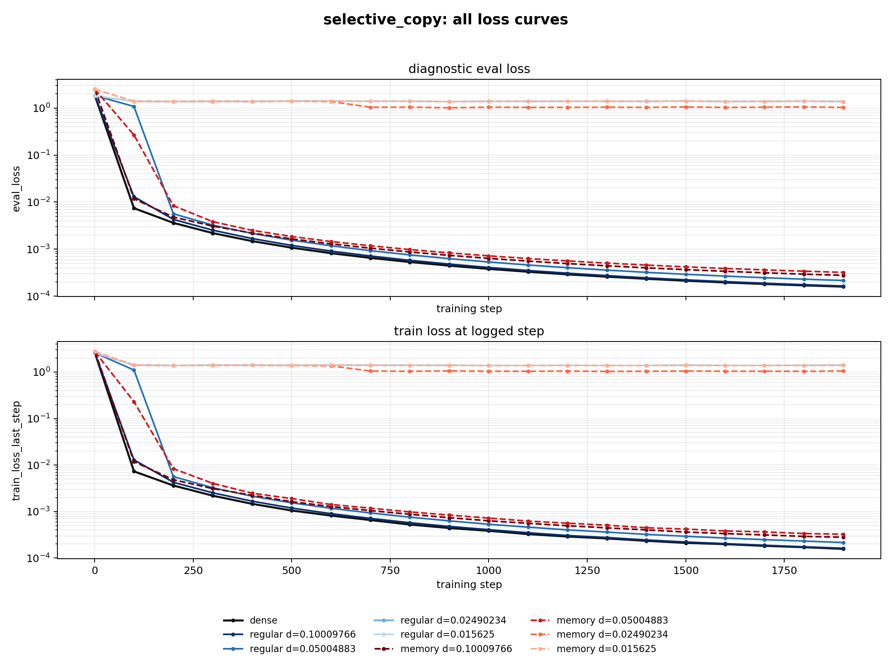
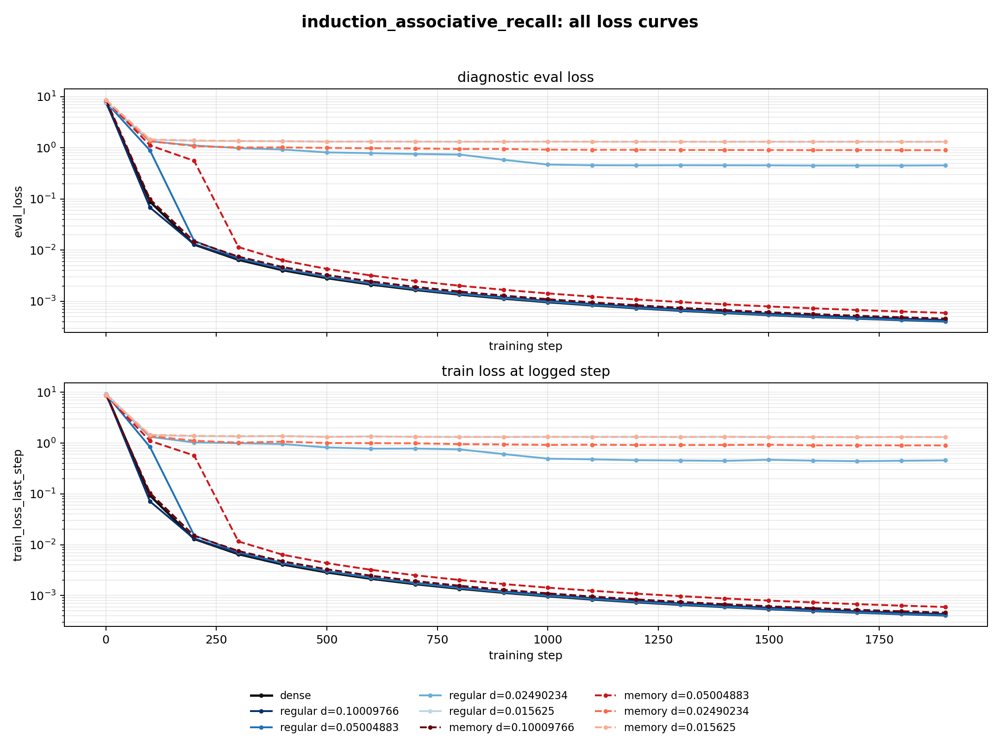
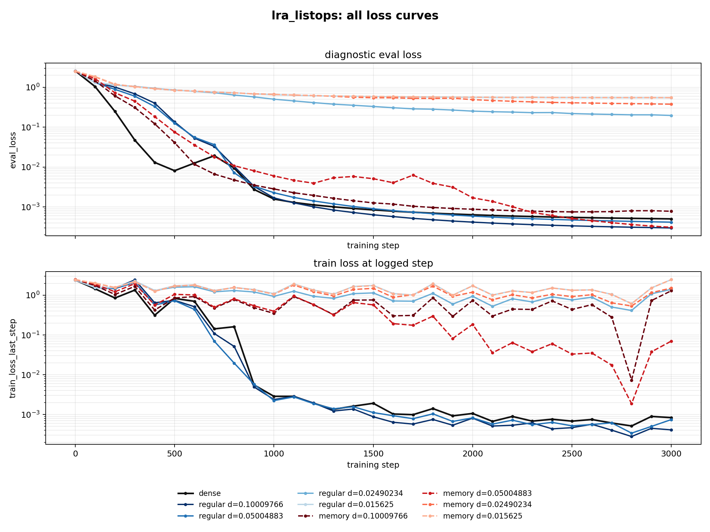

# probes_dense_to_one_easy_v02 loss curves

Generated with `scripts/plot_probe_dense_to_one_easy_v02_loss_curves.py`.

Each task figure contains every completed formal run for that task: `dense`,
`random_regular` at four actual densities, and `random_memory` at four actual
densities. The upper panel is diagnostic `eval_loss`; the lower panel is
`train_loss_last_step`. Both panels use a log y-axis.

## Figures

## Shared hyperparameters

| field | value |
| --- | --- |
| model family | probe_transformer_encoder_readout_rope_no_target_append |
| layers | 8 |
| d_model | 128 |
| heads | 4 |
| ffn_dim | 512 |
| dropout | 0.0 |
| position encoding | RoPE, q_and_k_only |
| absolute position embedding | none |
| optimizer | AdamW |
| base lr | 0.0003 |
| min lr | 0.00003 |
| lr scheduler | cosine |
| warmup | 0 steps, warmup_ratio 0.0 |
| cosine total steps | 3000 configured profile steps |
| weight decay | 0.0 |
| grad clip norm | 1.0 |
| batch size | 8 |
| gradient accumulation | 2 |
| effective batch size | 16 |
| eval batch size | 16 |
| log_every | 100 |
| configured epochs | 120 |

The LR schedule used by `run_probes_corrected.py` is:

`lr(step) = min_lr + 0.5 * (base_lr - min_lr) * (1 + cos(pi * step / total_steps))`

with `base_lr=3e-4`, `min_lr=3e-5`, `total_steps=3000`, and no warmup.

## Task-specific settings

| task | input length | target length | train examples | test examples | loss type | primary metric | dense steps completed | final dense lr | dense parameter count |
| --- | ---: | ---: | ---: | ---: | --- | --- | ---: | ---: | ---: |
| selective_copy | 64 | 4 | 256 | 256 | sequence_cross_entropy | selective_copy_token_accuracy | 1920 | 0.00011009055318476698 | 1590801 |
| induction_associative_recall | 64 | 4 | 256 | 256 | mqar_position_cross_entropy | retrieval_exact_match | 1920 | 0.00011009055318476698 | 3692033 |
| lra_listops | 64 | 1 | 400 | 400 | classification_cross_entropy | listops_accuracy | 3000 | 0.00003 | 1592862 |

